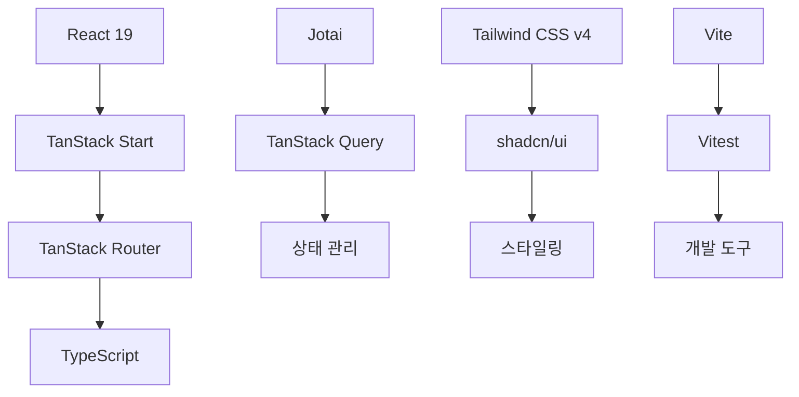
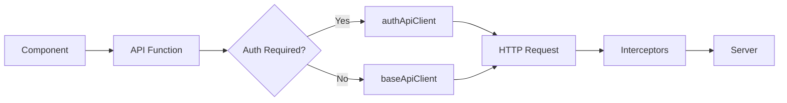
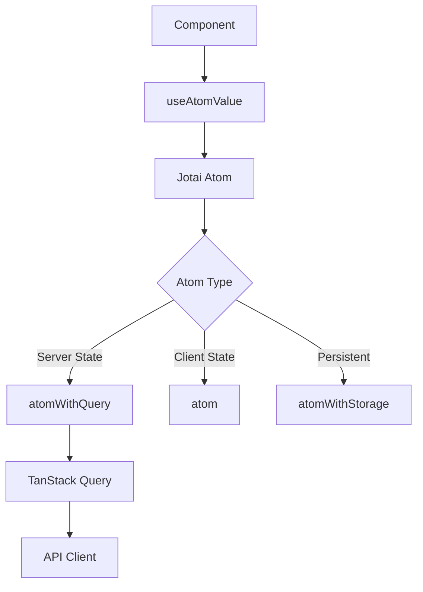

# 🏗️ 프로젝트 아키텍처

이룸클래스 React 프로젝트의 시스템 아키텍처와 설계 원칙을 설명합니다.

## 🎯 설계 원칙

### 1. 타입 안전성 우선

- **TypeScript strict 모드** 활성화
- **컴파일 시점 에러 검출**로 런타임 오류 방지
- **API 응답 타입 완전 정의**로 데이터 안전성 확보

### 2. 관심사 분리

- **도메인별 폴더 구조**로 코드 응집도 향상
- **레이어별 책임 분리** (API, 상태, 컴포넌트, 라우팅)
- **비즈니스 로직과 UI 로직 분리**

### 3. 재사용성과 확장성

- **컴포넌트 합성 패턴** (asChild)
- **커스텀 훅**으로 로직 캡슐화
- **설정 기반 확장** (variant 시스템)

### 4. 성능 최적화

- **SSR + 하이드레이션**으로 초기 로딩 최적화
- **이미지 preload**와 다단계 fallback
- **상태 기반 렌더링 최적화**

## 🛠 기술 스택 및 선택 이유



### Frontend Framework

- **React 19**: 최신 기능과 성능 개선 (Concurrent Features, Suspense)
- **TanStack Start**: React 19 기반 SSR 프레임워크로 Next.js 대안
- **TypeScript**: 타입 안전성과 개발 생산성

### 라우팅

- **TanStack Router**: 파일 기반 + 타입 안전한 라우팅
- **자동 코드 분할**과 **로더 기반 데이터 페칭**

### 상태 관리

- **Jotai**: 원자적 상태 관리로 불필요한 리렌더링 방지
- **TanStack Query**: 서버 상태 캐싱과 동기화

### 스타일링

- **Tailwind CSS v4**: 유틸리티 우선 CSS 프레임워크
- **shadcn/ui**: 고품질 컴포넌트 라이브러리

### 개발 도구

- **Vite**: 빠른 개발 서버와 빌드 도구
- **Vitest**: Jest 호환 테스트 프레임워크

## 📂 폴더 구조

```
src/
├── api/                    # API 레이어
│   ├── client/            # HTTP 클라이언트
│   │   ├── index.ts       # 클라이언트 export
│   │   ├── baseClient.ts  # 기본 API 클라이언트
│   │   ├── authClient.ts  # 인증 API 클라이언트
│   │   └── interceptors.ts # 공통 인터셉터
│   └── [domain]/          # 도메인별 API
│       ├── api.ts         # API 함수들
│       ├── types.ts       # 응답 타입 정의
│       └── query.ts       # React Query 옵션
│
├── atoms/                 # 상태 관리 레이어
│   ├── pokemon.ts         # 포켓몬 관련 상태
│   ├── health-check.ts    # 헬스체크 상태
│   └── ui.ts             # UI 관련 상태
│
├── components/            # 컴포넌트 레이어
│   ├── ui/               # 기본 UI 컴포넌트 (shadcn/ui)
│   ├── layout/           # 레이아웃 컴포넌트
│   └── [domain]/         # 도메인별 컴포넌트
│       ├── list/         # 목록 관련
│       ├── detail/       # 상세 관련
│       └── index.ts      # export 통합
│
├── hooks/                # 커스텀 훅 레이어
│   ├── [domain]/        # 도메인별 훅
│   └── ui/              # UI 관련 훅
│
├── routes/               # 라우팅 레이어 (파일 기반)
│   ├── __root.tsx       # 루트 레이아웃
│   ├── index.tsx        # 홈 페이지
│   └── examples/        # 예시 페이지들
│
├── utils/                # 유틸리티 레이어
│   ├── [domain]/        # 도메인별 유틸리티
│   └── errorHandling.ts  # 공통 에러 처리
│
└── css/                  # 스타일 레이어
    ├── root.css         # 전역 스타일
    ├── colors.css       # 색상 정의
    └── font.css         # 폰트 설정
```

### 폴더 구조 원칙

1. **도메인별 분리**: 각 비즈니스 도메인(pokemon, health-check)별로 코드 구성
2. **레이어별 구성**: API, 상태, 컴포넌트, 라우팅 등 레이어별 분리
3. **index.ts 통합**: 각 폴더에서 깔끔한 export 관리
4. **확장성 고려**: 새로운 도메인 추가 시 일관된 구조 유지

## 🔄 API 클라이언트 아키텍처



### 클라이언트 분리 전략

```typescript
// 기본 API 클라이언트 (인증 불필요)
export const baseApiClient = createBaseApiClient();

// 인증용 API 클라이언트 (httpOnly 쿠키 포함)
export const authApiClient = createAuthApiClient();
```

### 인터셉터 시스템

```typescript
// 요청 인터셉터: 로깅, 인증 헤더 추가
requestInterceptor: (config) => {
  console.log(`🚀 [API Request] ${config.method} ${config.url}`);
  return config;
}

// 응답 인터셉터: 에러 처리, 로깅
responseInterceptor: {
  onSuccess: (response) => response,
  onError: (error) => {
    if (error.status === 401) {
      // 인증 실패 처리
    }
    throw new ApiError(error);
  }
}
```

### 도메인별 API 구조

```typescript
// api/pokemon/api.ts
export async function fetchPokemonList(
  params: ListParams,
): Promise<PokemonListResponse> {
  return pokemonApiRequest<PokemonListResponse>({
    method: "GET",
    url: buildPokemonListUrl(params),
  });
}

// api/pokemon/query.ts
export const pokemonListQueryOptions = (filters: ListFilters) => ({
  queryKey: pokemonKeys.list(filters),
  queryFn: () => fetchPokemonList(filters),
  staleTime: 5 * 60 * 1000, // 5분
});
```

## 🧠 상태 관리 아키텍처



### Atom 계층 구조

```typescript
// 1. 기본 상태 (클라이언트)
export const pokemonPageAtom = atom<number>(1);

// 2. 영구 저장 상태 (localStorage)
export const pokemonLimitAtom = atomWithStorage("pokemon-limit", 24);

// 3. 서버 상태 (React Query 통합)
export const pokemonListQueryAtom = atomWithQuery((get) => {
  const page = get(pokemonPageAtom);
  const limit = get(pokemonLimitAtom);
  return pokemonListQueryOptions({ page, limit });
});

// 4. 계산된 상태 (derived)
export const filteredPokemonListAtom = atom((get) => {
  const { data, isPending, isError } = get(pokemonListQueryAtom);
  return { results: data?.results || [], isPending, isError };
});
```

### 상태 의존성 그래프

```
pokemonPageAtom ────┐
                    ├──→ pokemonListQueryAtom ──→ filteredPokemonListAtom
pokemonLimitAtom ───┘
```

### SSR 최적화 패턴

```typescript
// 서버에서 초기 데이터 로드
loader: async ({ context }) => {
  const data = await context.queryClient.ensureQueryData(
    pokemonListQueryOptions({ page: 1, limit: 24 }),
  );
  return { preloadImages: extractImageUrls(data) };
};

// 클라이언트에서 하이드레이션
useHydrateAtoms([
  [pokemonPageAtom, page],
  [pokemonListFiltersAtom, { search: keyword }],
]);
```

## 🛣️ 라우팅 아키텍처

### 파일 기반 라우팅

```
routes/
├── __root.tsx              # → /
├── index.tsx               # → /
├── examples/
│   └── pokemon/
│       ├── index.tsx       # → /examples/pokemon
│       ├── route.tsx       # 공통 레이아웃
│       └── $id/
│           └── index.tsx   # → /examples/pokemon/[id]
└── signup/
    └── index.tsx           # → /signup
```

### 타입 안전한 네비게이션

```typescript
// 자동 생성된 타입으로 안전한 라우팅
<Link
  to="/examples/pokemon/$id"
  params={{ id: "pikachu" }}    // 타입 체크됨
  search={{ page: 1 }}          // 타입 체크됨
>
  포켓몬 상세보기
</Link>
```

### 데이터 로더와 검증

```typescript
export const Route = createFileRoute("/examples/pokemon/")({
  // URL 파라미터 검증
  validateSearch: z.object({
    page: z.number().default(1),
    keyword: z.string().optional(),
  }),

  // 데이터 사전 로드
  loader: async ({ context, deps }) => {
    const data = await context.queryClient.ensureQueryData(
      pokemonListQueryOptions(deps),
    );
    return { preloadImages: extractImageUrls(data) };
  },

  // SEO 최적화
  head: ({ loaderData }) => ({
    links: loaderData?.preloadImages.map((url) => ({
      rel: "preload",
      as: "image",
      href: url,
    })),
  }),
});
```

## 🎨 컴포넌트 아키텍처

### 계층 구조

```
components/
├── ui/           # 기본 UI 컴포넌트 (shadcn/ui)
│   ├── button.tsx
│   ├── card.tsx
│   └── ...
├── layout/       # 레이아웃 컴포넌트
│   ├── NavigationBar.tsx
│   └── ...
└── [domain]/     # 도메인 컴포넌트
    ├── list/     # 목록 관련
    ├── detail/   # 상세 관련
    └── shared/   # 공통 컴포넌트
```

### 컴포넌트 합성 패턴

```typescript
// asChild 패턴으로 컴포넌트 합성
<Button variant="ghost" asChild>
  <Link to="/examples/pokemon">포켓몬</Link>
</Button>

// Slot을 통한 유연한 합성
function Button({ asChild, ...props }) {
  const Comp = asChild ? Slot : "button";
  return <Comp {...props} />;
}
```

### 재사용 가능한 패턴

```typescript
// 1. Props 타입 정의
type ComponentProps = {
  /** 설명 */
  prop: string;
};

// 2. 커스텀 훅 분리
const useComponentLogic = () => {
  // 복잡한 로직
  return { state, handlers };
};

// 3. 컴포넌트 구현
export function Component(props: ComponentProps) {
  const logic = useComponentLogic();
  return <div>{/* JSX */}</div>;
}
```

## ⚡ 성능 최적화 전략

### 1. 이미지 최적화

```typescript
// 사전 로드
head: ({ loaderData }) => ({
  links: preloadImages.map((url) => ({
    rel: "preload",
    as: "image",
    href: url,
    fetchPriority: "high",
  })),
});

// 다단계 fallback
const handleImageError = (e) => {
  if (current === primaryUrl) {
    e.target.src = fallbackUrl;
  } else if (current === fallbackUrl) {
    e.target.src = placeholderUrl;
  }
};
```

### 2. 상태 기반 최적화

```typescript
// derived atom으로 계산 최적화
export const expensiveCalculationAtom = atom((get) => {
  const data = get(dataAtom);
  return heavyCalculation(data); // 의존성 변경시만 재계산
});

// 선택적 구독으로 렌더링 최적화
const value = useAtomValue(specificAtom); // 읽기 전용
const setValue = useSetAtom(specificAtom); // 쓰기 전용
```

### 3. 번들 최적화

```typescript
// 동적 import로 코드 분할
const LazyComponent = lazy(() => import("./HeavyComponent"));

// 라우트별 자동 코드 분할 (TanStack Router)
// routes/heavy-page/index.tsx → 별도 번들
```

## 🔧 확장성 고려사항

### 1. 새로운 도메인 추가

```
1. api/[new-domain]/ 폴더 생성
2. atoms/[new-domain].ts 상태 정의
3. components/[new-domain]/ 컴포넌트 작성
4. routes/[new-domain]/ 라우트 추가
```

### 2. 국제화 (i18n) 준비

```typescript
// 텍스트 하드코딩 대신 키 기반 관리
const messages = {
  ko: { welcome: "환영합니다" },
  en: { welcome: "Welcome" },
};
```

### 3. 테마 시스템 확장

```typescript
// CSS 변수 기반 테마
:root {
  --primary: 220 14% 96%;
  --secondary: 220 13% 91%;
}

[data-theme="dark"] {
  --primary: 220 14% 4%;
  --secondary: 220 13% 9%;
}
```

## 🎯 아키텍처 의사결정 기록

### ADR-001: TanStack Start 선택

- **배경**: Next.js 대안 필요
- **결정**: TanStack Start 채택
- **이유**: React 19 지원, 타입 안전성, 성능

### ADR-002: Jotai + React Query 조합

- **배경**: 복잡한 상태 관리 필요
- **결정**: Jotai와 React Query 통합
- **이유**: 원자적 상태 관리와 서버 상태 분리

### ADR-003: shadcn/ui 채택

- **배경**: 일관된 디자인 시스템 필요
- **결정**: shadcn/ui 기반 컴포넌트 시스템
- **이유**: 커스터마이징 용이, Tailwind 통합

---

이 아키텍처는 지속적으로 진화하며, 새로운 요구사항에 따라 개선됩니다.
